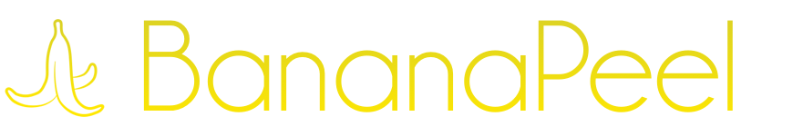

[](http://twitter.com/thematerik)
[](https://cocoapods.org/pods/BananaPeel)
[](https://travis-ci.org/materik/bananapeel)


Contextual XCode UI testing framework

## Install

```bash
pod 'BananaPeel'
```

## Example

```swift
func test() {
    Banana()
        .addLaunchEnvironment(key: "isTesting", value: "true")
        .peel()
        .assert {
            XCTAssertTrue($0.navigationBars["My App"].exists)
        }
        .tap {
            $0.tabBars.buttons["Tab 2"]
        }
        .assert {
            XCTAssertTrue($0.navigationBars["Settings"].exists)
        }
        .peelOff()
}
```

